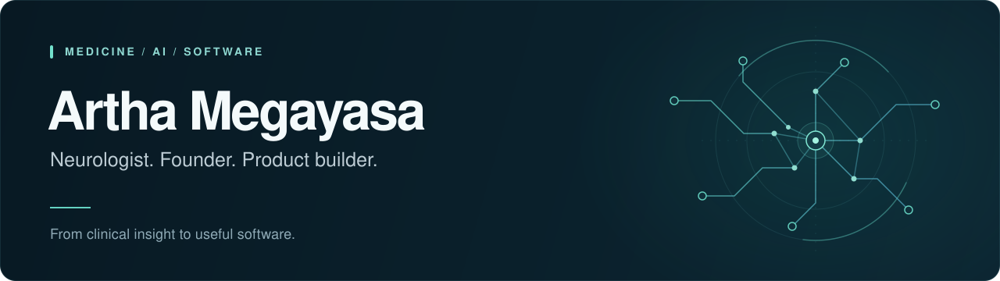

  

  <a href="https://www.arthamegayasa.com"><b>Writing &amp; ideas</b></a> &nbsp; / &nbsp;
  <a href="https://www.digipad.id"><b>Digipad studio</b></a> &nbsp; / &nbsp;
  <a href="https://neurorestorasi.id"><b>Clinical practice</b></a> &nbsp; / &nbsp;
  <a href="mailto:arthamegayasa@ihc.id"><b>Get in touch</b></a>

  
  
  

## A clinician's perspective. A builder's mindset.

I'm **Artha**, a neurologist based in **Bali, Indonesia**, and the founder of **[Digipad](https://www.digipad.id)**. I build software at the intersection of medicine, AI, and everyday work: clinical documentation, patient-facing tools, and systems that make complex workflows easier to use.

My clinical interests span **neurology, neurorehabilitation, brain health, and longevity**. I bring that perspective into product design, using AI agents to help turn an idea into working software. I also make room for creative experiments, from interactive fiction to illustrated books.

## Selected public work

<table>
  <tr>
    <td width="50%" valign="top">
      01 / CLINICAL AI
      <h3><a href="https://github.com/arthamegayasa/bih-ai-transcription">BIH AI Transcription</a></h3>
      
An interactive documentation demo that turns mock Indonesian consultations into draft SOAP notes.

      
<code>JavaScript</code> <code>Web Speech API</code> <code>Claude</code>

      <a href="https://github.com/arthamegayasa/bih-ai-transcription">Explore the demo code →</a>
    </td>
    <td width="50%" valign="top">
      02 / AGENT WORKFLOWS
      <h3><a href="https://github.com/arthamegayasa/nam-book-studio">Nam Book Studio</a></h3>
      
An evidence-aware agent skill suite for researching, writing, and illustrating books in English and Indonesian.

      
<code>Python</code> <code>Agent Skills</code> <code>Publishing</code>

      <a href="https://github.com/arthamegayasa/nam-book-studio">Explore the toolkit →</a>
    </td>
  </tr>
  <tr>
    <td width="50%" valign="top">
      03 / HEALTHCARE ON THE WEB
      <h3><a href="https://github.com/arthamegayasa/MettyCare-web">MettyCare</a></h3>
      
A bilingual home care website for Bali, with responsive layouts and direct WhatsApp contact flows.

      
<code>HTML</code> <code>CSS</code> <code>JavaScript</code>

      <a href="https://github.com/arthamegayasa/MettyCare-web">Explore the website code →</a>
    </td>
    <td width="50%" valign="top">
      04 / INTERACTIVE WORLDS
      <h3><a href="https://github.com/arthamegayasa/Wuxia-Dungeon-RPG">Wuxia Dungeon RPG</a></h3>
      
A browser-based cultivation RPG with branching choices, procedural narrative, and deterministic game systems.

      
<code>TypeScript</code> <code>React</code> <code>Vite</code>

      <a href="https://github.com/arthamegayasa/Wuxia-Dungeon-RPG">Explore the game →</a>
    </td>
  </tr>
</table>

**Also exploring:** [Brainwave Audio Entrainment](https://github.com/arthamegayasa/brainwave-audio-entrainment), a cross-platform audio app for binaural and isochronic listening sessions.

## How I build

**Understand the workflow → Build a focused version → Test and refine.**

I use AI-assisted development to connect domain knowledge with implementation. My role spans defining the problem, shaping the experience, directing agents, and reviewing what gets built.

| Layer | Tools I work with |
| :--- | :--- |
| Interfaces | TypeScript · React · Next.js · Astro · Tailwind CSS |
| Data & delivery | Node.js · PostgreSQL · Supabase · Vercel |
| AI & automation | Claude Code · Codex · Python · Agent Skills |

## Beyond the repositories

- **[Digipad](https://www.digipad.id)** — my studio for software, AI agents, and workflow automation.
- **[Neurorestorasi](https://neurorestorasi.id)** — my clinical practice and resources for patients and families.
- **[arthamegayasa.com](https://www.arthamegayasa.com)** — writing on brain health, longevity, and technology.

---

  <b>Have a healthcare workflow or a product idea worth building?</b> 
  <a href="mailto:arthamegayasa@ihc.id">Let's connect</a> &nbsp; · &nbsp; <a href="https://www.digipad.id">Explore Digipad</a>

